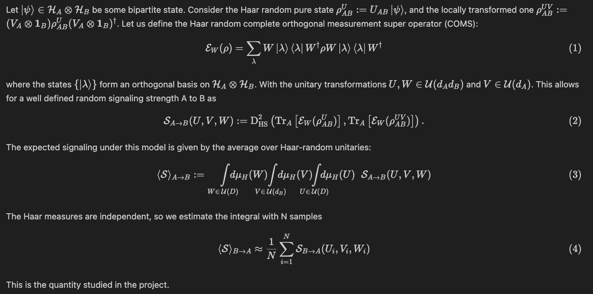

# Expected Signaling and Emergent Causality

### Introduction



<!-- Let $\ket{\psi} \in \mathcal{H}_A \otimes \mathcal{H}_B$ be some bipartite state. Consider the Haar random pure state $\rho_{AB}^U := U_{AB} \ket{\psi}$, and the locally transformed one $\rho_{AB}^{UV} := ( V_A \otimes \mathbf{1}_B ) \rho_{AB}^{U} (V_A \otimes \mathbf{1}_B )^\dagger$. Let us define the Haar random complete orthogonal measurement super operator (COMS):

$$
\begin{align}
    \mathcal{E}_{W}(\rho) = \sum_\lambda W \ket{\lambda} \bra{\lambda} W^\dagger \rho W \ket{\lambda} \bra{\lambda} W
    ^\dagger
\end{align}
$$

where the states $\{ \ket{\lambda} \}$ form an orthogonal basis on $\mathcal{H}_A \otimes \mathcal{H}_B$. With the unitary transformations $U, W \in \mathcal{U}(d_A d_B)$ and $V \in \mathcal{U}(d_A)$. This allows for a well defined random signaling strength A to B as

$$
\begin{align}
    \mathcal{S}_{A \to B} (U, V, W) := \text{D}^2_{\text{HS}} \left( \text{Tr}_A \left[ \mathcal{E}_{W}(\rho_{AB}^U) \right], \text{Tr}_A \left[ \mathcal{E}_{W}( \rho_{AB}^{UV} ) \right] \right).
\end{align}
$$

The expected signaling under this model is given by the average over Haar-random unitaries:

$$
\begin{align}
    \langle \mathcal{S} \rangle_{A \to B} :=
    \int\limits_{W \in \, \mathcal{U}(D)}   \hspace{-0.35cm} d\mu_H(W) \hspace{-0.5cm}
    \int\limits_{V \in \, \mathcal{U}(d_B)} \hspace{-0.35cm} d\mu_H(V) \hspace{-0.5cm}
    \int\limits_{U \in \, \mathcal{U}(D)}   \hspace{-0.35cm} d\mu_H(U) \hspace{.20cm}
    \mathcal{S}_{A \to B} (U, V, W)
\end{align}
$$

The Haar measures are independent, so we estimate the integral with N samples

$$
\begin{align}
    \langle \mathcal{S} \rangle_{B \to A} \approx \frac{1}{N} \sum_{i=1}^N \mathcal{S}_{B \to A} (U_i, V_i, W_i)
\end{align}
$$

This is the quantity studied in the project. -->

### Setup

```
pip install uv
uv sync
uv run <file>
```

### Main Package - QuTiP

[Citing QuTiP](https://qutip.org/citing.html)

```
@misc{lambert2024qutip,
    title={QuTiP 5: The Quantum Toolbox in Python},
    author={Neill Lambert and Eric Giguère and Paul Menczel and Boxi Li and Patrick Hopf and Gerardo Suárez and Marc Gali and Jake Lishman and Rushiraj Gadhvi and Rochisha Agarwal and Asier Galicia and Nathan Shammah and Paul Nation and J. R. Johansson and Shahnawaz Ahmed and Simon Cross and Alexander Pitchford and Franco Nori},
    year={2024},
    eprint={2412.04705},
    archivePrefix={arXiv},
    primaryClass={quant-ph}
}
```
